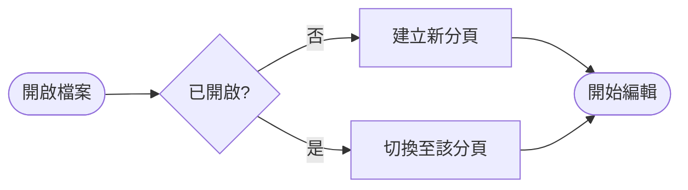
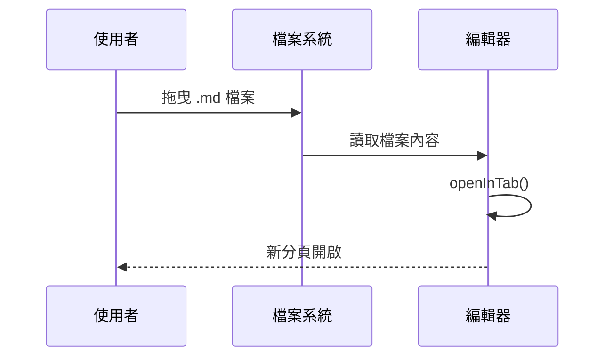
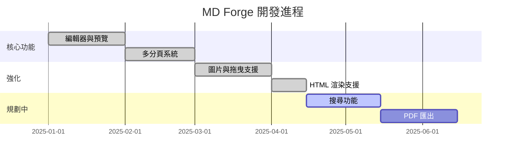

# MD Forge 功能展示

> 本地優先的桌面 Markdown 編輯器 — 即時預覽、多分頁、Mermaid 圖表

---

## 文字排版

一般段落文字，支援 **粗體**、*斜體*、~~刪除線~~、`行內程式碼`，以及 [超連結](https://github.com/Racious/MD-Forge)。

> 引用區塊：寫作是一種思考的延伸。好的工具應該消失在背景裡，讓思維自由流動。

---

## Task List

- [x] 多分頁編輯
- [x] 即時 Markdown 預覽
- [x] Mermaid 圖表渲染
- [x] 本機圖片顯示
- [x] 拖曳開檔
- [x] 單一實例模式
- [ ] 搜尋功能（規劃中）
- [ ] PDF 匯出（規劃中）

---

## 程式碼

```typescript
// editorStore — 開啟或切換至已存在的分頁
function openInTab(document: MarkdownDocument): void {
  if (document.path) {
    const existing = tabs.value.find(t => t.document.path === document.path);
    if (existing) {
      switchTab(existing.id);
      return;
    }
  }
  const id = generateId();
  const tab: Tab = { id, document: { ...document } };
  tabs.value.push(tab);
  activeTabId.value = id;
  currentDocument.value = tab.document;
  renderPreview();
}
```

```rust
// lib.rs — 單一實例：第二個視窗啟動時傳送檔案路徑至既有視窗
fn emit_open_file(handle: &tauri::AppHandle, path: String) {
    if let Ok(content) = std::fs::read_to_string(&path) {
        if let Some(window) = handle.get_webview_window("main") {
            let _ = window.set_focus();
            let _ = window.emit("open-file", (path, content));
        }
    }
}
```

---

## 表格

| 功能 | 說明 | 狀態 |
|------|------|------|
| 多分頁 | 同時編輯多個檔案 | ✅ |
| 即時預覽 | Split / Preview 模式 | ✅ |
| Mermaid | 圖表直接在 MD 中繪製 | ✅ |
| HTML 匯出 | 含完整樣式的獨立檔案 | ✅ |
| TOC 導覽 | 自動生成目錄並錨點跳轉 | ✅ |
| 拖曳開檔 | 拖入視窗即開新分頁 | ✅ |

---

## Mermaid 圖表

### 流程圖



### 循序圖



### 甘特圖



---

## 數學式風格清單

1. 第一層項目
   - 第二層 A
   - 第二層 B
     - 第三層細項
2. 第二個項目
3. 第三個項目

---

## 水平線與結語

---

*MD Forge — 本地優先，隱私自主。*  
所有資料僅存於本機，零網路請求，零雲端同步。
