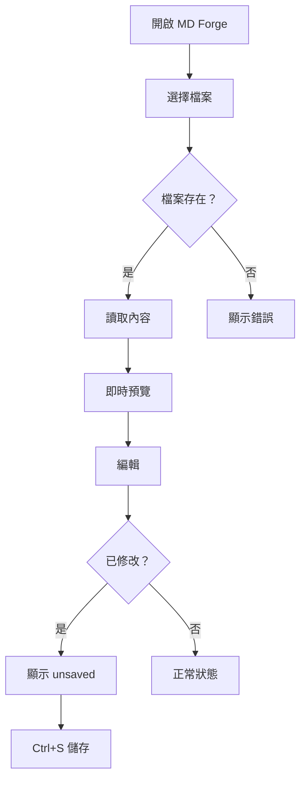
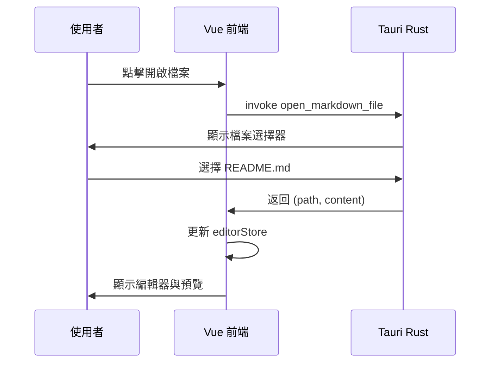
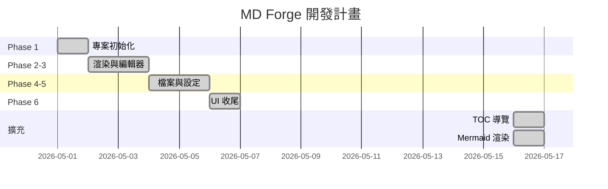

# MD Forge 功能測試文件

這份文件用於測試 MD Forge 的所有渲染功能。

---

## 標題層級

# H1 標題
## H2 標題
### H3 標題
#### H4 標題
##### H5 標題
###### H6 標題

---

## 文字格式

**粗體文字** 與 *斜體文字* 與 ***粗斜體***

~~刪除線文字~~

`行內程式碼`

這是一段普通段落，包含 [連結文字](https://example.com) 的示範。

---

## 清單

### 無序清單

- 項目一
- 項目二
  - 子項目 A
  - 子項目 B
    - 更深一層
- 項目三

### 有序清單

1. 第一步
2. 第二步
3. 第三步

### Task List

- [x] 已完成：開啟檔案功能
- [x] 已完成：即時預覽
- [x] 已完成：TOC 導覽列
- [x] 已完成：Mermaid 渲染
- [ ] 待辦：KaTeX 數學公式
- [ ] 待辦：多分頁編輯

---

## 引用區塊

> 這是一段引用文字。
>
> 可以有多個段落。
>
> — 出處

---

## 程式碼區塊

### TypeScript

```typescript
interface MarkdownDocument {
  path: string | null;
  fileName: string;
  content: string;
  isDirty: boolean;
}

function renderMarkdown(content: string): string {
  return md.render(content);
}
```

### Rust

```rust
#[tauri::command]
async fn save_file(path: String, content: String) -> Result<(), String> {
    std::fs::write(&path, content)
        .map_err(|e| format!("Failed to write: {}", e))
}
```

---

## 表格

| 功能 | 狀態 | 說明 |
|------|------|------|
| 開啟檔案 | ✅ | 支援 .md .markdown .mdx |
| 即時預覽 | ✅ | 分割模式同步更新 |
| TOC 導覽 | ✅ | 自動從標題生成 |
| Mermaid | ✅ | 流程圖、序列圖等 |
| HTML 匯出 | ✅ | 完整樣式輸出 |
| 暗色模式 | ✅ | 亮色 / 暗色切換 |

---

## Mermaid 圖表

### 流程圖



### 循序圖



### 甘特圖



---

## 圖片


---

## 水平線

以上就是全部測試內容。

---

*由 MD Forge 渲染*
